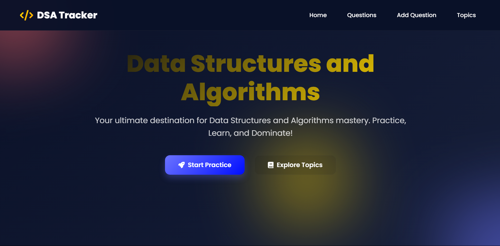
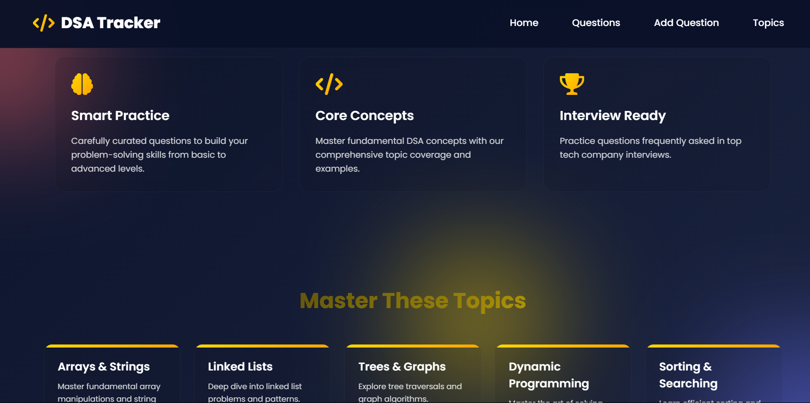
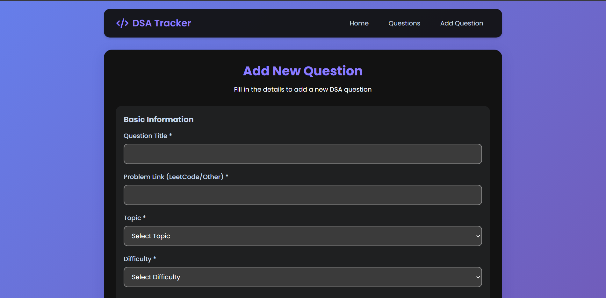

# 🧠 DSA Tracker – Practice, Reflect & Master

A personalized full-stack platform to help students **learn**, **track**, and **retain** Data Structures and Algorithms more effectively.

---

## 🚨 Problem

Most students struggle with DSA not just because of complexity, but because they **forget key insights, intuition, and patterns** over time. While practicing problems is easy, **retaining the thought process** — the "why" and "how" — is difficult. There's no single place where students can:

- Record their own intuition & approach.
- Note pitfalls or edge cases.
- Link similar pattern-based problems.
- Track topic-wise progress visually.

---

## 💡 Solution

### 🔧 What I Built

A full-stack **DSA Tracker** that lets users:

- ✍️ **Add custom questions** they've solved.
- 💭 **Write their own intuition**, approach, and dry-run steps.
- ⚠️ **Document mistakes/pitfalls** they faced.
- 🔁 **Link similar questions** to reinforce learning patterns.
- 📊 **Track progress** by topic and difficulty.
- 🏷️ Organize questions by **tags**, **difficulty**, and **topic**.

This is more than a note-taking app — it’s a **reflection-based learning tool** designed to turn passive practice into active mastery.

---

## 🧪 Testing Focus (SDET-Relevant)

Though a full-stack product, I implemented testing practices that align with real-world QA standards:

- ✅ **Unit Testing**: Controllers for adding & updating questions (`Jest`).
- 🔗 **API Integration Tests**: Using `Supertest` for endpoints like `/add-question`, `/get-questions`.
- 🌐 **End-to-End Testing (E2E)**: Simulated user journey (register → login → add question → view progress) using `Cypress`.
- 🛠️ **Dummy App Testing Setup**: Includes basic Express server mock + test scaffolding to show readiness for testing practices.
- 🔄 **CI-ready structure** with test folders & scripts to plug into automated pipelines (e.g., GitHub Actions).

---

## 🧰 Tech Stack

| Frontend | Backend           | Database | Testing                  |
| -------- | ----------------- | -------- | ------------------------ |
| React.js | Node.js + Express | MongoDB  | Jest, Supertest, Cypress |

---

## 📸   

---

## 🚀 How to Run Locally

```bash
git clone https://github.com/your-username/dsa-tracker.git
cd dsa-tracker
npm install
npm start
```
